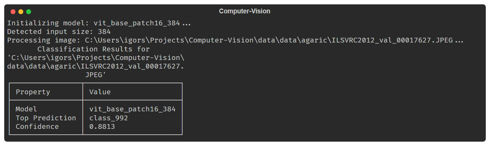

# 🍄 Mushroom Computer Vision Project

A high-performance image classification pipeline for mushroom detection, built with modern Python standards and Clean Architecture.



*A real run: ViT-Base at 384 px identifies an ImageNet validation photograph as
class 992 — `agaric` — with 0.88 confidence. Labels appear as indices because
this model's `default_cfg` carries no `label_names`.*

## 🏗️ Architecture

This project follows the **Clean (Hexagonal) Architecture** pattern to ensure the domain logic is isolated from external frameworks.

- **Domain**: Contains core models (`ClassificationResult`, `Prediction`) and interfaces (`ImageClassifier`, `ImageLoader`). Zero dependencies on external libraries.
- **Application**: Orchestrates workflows via `ClassifierService`.
- **Infrastructure**: Adapters for external libraries like `timm` and `PIL`.

## 🚀 Performance & Optimization

The codebase is optimized for latency and throughput:
- **Mixed Precision (FP16)**: Inference is performed in half-precision on supported hardware to reduce memory bandwidth and increase speed.
- **Dynamic Input Sizing**: Models like ViT automatically scale to their optimal input resolution (e.g., 224, 384).
- **Profiling**: Detailed profiling results are available in `profile_results_optimized.txt`.

### Measured: everything around the model

Inference is the model's cost. What this repository controls is the
preprocessing around it — `benchmarks/test_pipeline_performance.py`, median of
many rounds:

| What is measured | Median |
| --- | ---: |
| Missing file — the failure path | 18.8 µs |
| Preprocess a 224 × 224 JPEG | 964 µs |
| Preprocess a 512 × 512 JPEG | 4.30 ms |
| Service: load + orchestrate, model stubbed (512 px source) | 4.26 ms |
| Preprocess to a 384 px target (512 px source) | 5.75 ms |
| Preprocess a 2048 × 2048 JPEG | 56.9 ms |

**The layering is free.** The service measures 4.26 ms against 4.30 ms for the
load it contains — within run-to-run noise, so ports, Protocols and the
orchestrating class cost nothing measurable. Clean Architecture is not what
makes anything slow here.

**Cost is roughly linear in source area.** A 2048 × 2048 photograph spends
~57 ms on the CPU before the model sees it, comparable to the inference it is
feeding. Downscale large images before the loader, not after. The target size
matters too: asking for 384 px instead of 224 px from the same file costs a
third more.

```bash
pytest benchmarks --benchmark-only
```

## 💻 Hardware Requirements

- **GPU Support**: Automatic detection of **CUDA** (NVIDIA) and **MPS** (Apple Silicon).
- **Fallback**: Graceful fallback to CPU if no GPU is available.

## 🛠️ Usage

### Installation
```bash
# Recommended: Create a virtual environment
python -m venv venv
source venv/bin/activate  # or venv\Scripts\activate on Windows

# Install dependencies
pip install -e ".[dev]"
```

### Classification
Use `main.py` for advanced classification using the service layer:
```bash
python main.py data/data/agaric/example.jpg
```

### Rapid Prototyping
Use `task3.py` for a simpler, script-based approach to ImageNet classification.

## 📚 Documentation

Automatically generated HTML documentation is available in the `docs/` directory. 
To regenerate:
```bash
python .agent/scripts/docs_python.py
```
