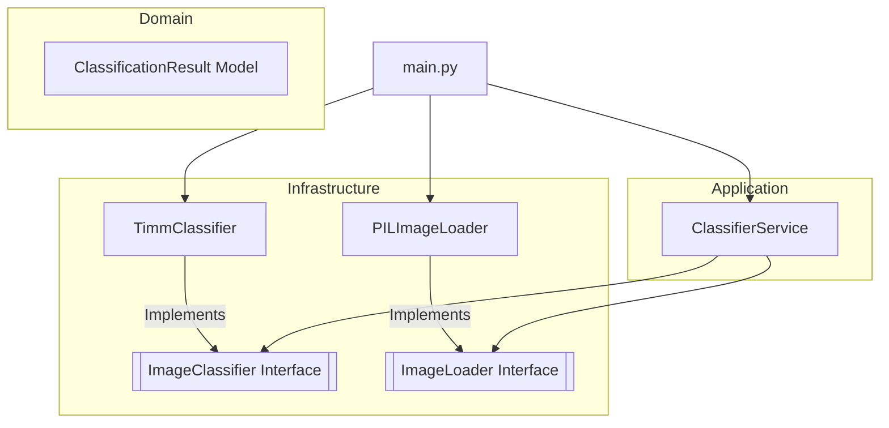

# System Architecture

## Design Philosophy

The project adheres to the **Clean Architecture** (specifically **Hexagonal Architecture**) to maximize maintainability and testability. The core domain logic is decoupled from external technology choices.

## Component Overview

### 1. Domain Layer (`src.domain`)
- **Entities**: Data structures like `Prediction` and `ClassificationResult`.
- **Interfaces**: Abstract base classes that define the "Port" for the infrastructure adapters.

### 2. Application Layer (`src.application`)
- **Services**: Orchestrates the interaction between domain entities and repository interfaces. Does not know about `torch` or `timm` directly.

### 3. Infrastructure Layer (`src.infrastructure`)
- **Adapters**: Concrete implementations of domain interfaces. This is where heavy-lift libraries like `torch`, `torchvision`, and `timm` reside.

## Hardware Acceleration

We implement a strategy pattern for hardware detection:
1.  **CUDA**: Preferred for NVIDIA GPUs.
2.  **MPS**: Used for hardware acceleration on Apple Silicon.
3.  **CPU**: Fallback for standard environments.

Mixed precision (FP16) is automatically toggled when a GPU is detected to optimize performance.
